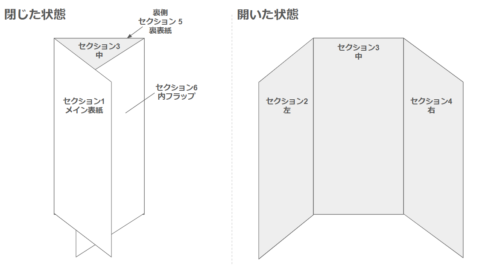

# 🌴 travel-shiori (旅のしおり作成ツール)

Obsidian 等で書き溜めた旅行計画（Markdown）を、家族がワクワクするような「美しく機能的な印刷用しおり」へとブラウザ上で自動変換するツールです。

https://naosim.github.io/travel-shiori/generator.html

## 🚀 プロジェクト概要
旅行の計画段階では Obsidian の柔軟なメモ機能が便利ですが、実際に旅行に携行する際は、家族全員が見やすく、かつ期待感を高めるようなデザインが求められます。

本プロジェクトは、YAGNI 原則（You Ain't Gonna Need It）に基づき、複雑なフレームワークを極力排除しながら、実用性と機能美を兼ね備えた「三つ折り・両面印刷」のしおりを生成します。

- Markdown 駆動: Obsidian や各種エディタで作成した `.md` ファイルを読み込むだけで、即座にレイアウトを生成。
- プレミアム・エコ・デザイン: 
  - インク消費を抑える「白背景」基調のデザイン。
  - A4 用紙 1 枚・両面印刷・三つ折りで完成する極めて機能的なレイアウト。
- AI 親和性 (コールアウト表示): ChatGPT や Claude 等で生成した「旅先の豆知識」や「歴史的背景」を、おしゃれなデザインボックス（Tip/Info）として表示。
- 機能的なタイムライン: 時刻、移動手段、メモを 3 列構成で美しく整列。
- モバイル・デスクトップ両対応: インストール不要。ブラウザがあればどこでも調整・印刷が可能。

## 📐 6パネル・自由構成システム
本ツールは、1枚の Markdown ファイルを `---` (水平線) で **6つのセクション** に分割し、三つ折り（左開き・横書き用）の各パネルに自動的にマッピングします。

### セクションと物理配置の対応
作成者が Markdown を書く順番（1から6）が、しおりを手に取った時の体験順になります。

| 順序 | 役割 | 物理的な配置 (A4面) | ユーザーの体験 |
| :--- | :--- | :--- | :--- |
| **1** | **メイン表紙** | **外面：右パネル** | 閉じた状態の「顔」 |
| **2** | **内フラップ** | **外面：左パネル** | 最初にめくった時に現れるサブ情報 |
| **3** | **内面：左** | **内面：左パネル** | 開いた見開きの一番左（初日など） |
| **4** | **内面：中** | **内面：中央パネル** | 見開きの中心（メイン内容） |
| **5** | **内面：右** | **内面：右パネル** | 見開きの右端（最終日/持ち物など） |
| **6** | **裏表紙** | **外面：中央パネル** | 折り畳んだ時に背面にくる面（連絡先など） |

### 📝 記述ルール
- **デザイン・カスタマイズ (YAMLフロントマター)**: Markdown の冒頭を `---` で囲むことで、デザインを微調整できます。
  ```markdown
  ---
  titleSize: 32pt      # 表紙タイトルのサイズ
  titleColor: #2c3e50  # タイトルの色
  subtitleSize: 14pt   # サブタイトルのサイズ
  spacing: 8px         # 全体の行間（余白）
  ---
  ```
- **表紙 (セクション1)**:
  - `# タイトル`: 大きなタイトル枠で表示されます。
  - その他の行（または `##`）: サブタイトルとして中央配置されます。
- **パネルの区切り**: `---` のみを含む行で区切ります。
- **省略可能**: セクションを 6 つ書く必要はありません。例えば「表紙」と「1日目」の 2 セクションだけ書けば、残りのパネルは自動的に「自由記入欄（メモ書き用）」として出力されます。
- **タイムラインの自動認識**: 各セクション内に以下のような形式のリストがあれば、自動的に垂直線のタイムラインとしてレンダリングされます。
  - `HH:mm 行程名`: タイムラインの主要ポイント（ドット＋時刻＋内容）。
  - `  - | 移動手段や補足`: 直前の工程から次の工程への「線」の横に表示される注釈ラベル。
  - `  - 補足メモ`: 行程の下に表示される詳細な説明文。
- **チェックリスト**: `- [ ]` 形式のリストは、印刷用のチェックボックスとして表示されます。
- **太字について**: Markdown 内での太字 (`**...**`) は、視認性低下を避けるため最小限に留めるか、不要です（数字等はシステム側で自動的に強調されます）。

---

## 🗺️ レイアウト構成イメージ (A4 横)

### 表面 (Outer Page)
「外面（そとめん）」は、印刷した紙を裏返した面です。

| [左] セクション 2 | [中] セクション 6 | [右] **セクション 1** |
| :--- | :--- | :--- |
| 内フラップ (豆知識) | 裏表紙 (メモ/連絡先) | **メイン表紙** |

### 内面 (Inner Page)
「内面（うちめん）」は、表紙をめくって一望するメインの 3 連パネルです。

| [左] セクション 3 | [中] セクション 4 | [右] セクション 5 |
| :--- | :--- | :--- |
| スケジュール (Day 1) | スケジュール (Day 2) | スケジュール (Day 3) |

### 実際の出力イメージ

---

## 🚀 使い方とワークフロー (Workflow)

本ツールは **GitHub Pages** に対応しています。リポジトリの `docs/` ディレクトリに公開用の Generator が配置されており、ブラウザから直接アクセスして利用可能です。

### 1. 準備：Markdown を書く
- 手元のエディタ（Obsidian やメモ帳など）で、`---` 区切りの 6 セクション構成で内容を作成します。
- 記述ルール（タイムラインやチェックリスト）に従って書くことで、自動的にデザインが反映されます。

### 2. 生成：Generator の使用
1. 公開されている Generator ページ（またはローカルの `docs/generator.html`）をブラウザで開きます。
2. 以下のいずれかの方法で内容を読み込ませます：
   - **直接入力（リアルタイムプレビュー）**: 画面上のテキストエリアに Markdown を直接貼り付ける。
   - **ファイル選択/ドロップ**: 作成した `.md` ファイルを読み込ませる。
3. プレビュー画面で、三つ折りの各パネルが正しくレイアウトされているか確認します。
   - 内容を書き換えると、プレビューが即座に反映されます。

### 3. 出力：印刷とPDF保存
1. ブラウザの「印刷」機能 (`Ctrl + P`) を開きます。
2. 設定を「横向き」「両面印刷（短辺）」、詳細設定で「背景のグラフィック」にチェックを入れて実行します。

---

## 📁 ディレクトリ構造
- `docs/`: GitHub Pages 公開用。`generator.html` だけで全ての機能が動作します。
- `spec/`: サンプルデータ、レイアウトガイドを格納。

---

## 🛠 技術スタック
- **Core**: Vanilla JavaScript (Markdown 解析 / リアルタイムレンダリング)
- **Styling**: Vanilla CSS (Print-optimized, Flexible Layout)
- **Fonts**: Outfit (数字/英字), Noto Sans JP (日本語)

---
Produced by Antigravity Assistant.
